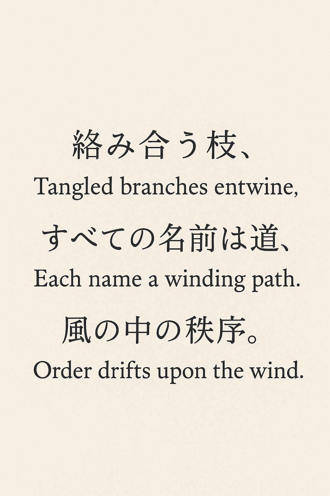

<p align='center'>
  
</p>

<h1 align='center'>namae-no-eda (名前の枝)</h1>
<p align='center'>Keep your branch names tidy, like leaves on a tree</p>

<p align='center'>
  
</p>

## Example

This workflow validates branch names using `namae-no-eda`. Branches must match at least one allowed pattern, unless explicitly excluded.

```yaml
name: Branch Lint
on:
  pull_request:
    branches:
      - '**'
  push:
    branches:
      - '**'

jobs:
  branch-lint:
    runs-on: ubuntu-latest
    steps:
      - name: Check out repository
        uses: actions/checkout@v4

      - name: Validate branch name
        uses: dcdavidev/namae-no-eda@v1.0.0
        with:
          allowed: 'fix/*,feature/*,release/*'
          exclude: 'main,develop'
```

## How it works

- `allowed`: Comma-separated glob patterns that branch names must match.
- `exclude`: Comma-separated exact branch names to bypass validation.
- `branch_name` (optional): Defaults to the branch triggering the workflow; only override if you need to validate a specific branch.

If the branch name does not match any allowed patterns and is not excluded, the action will fail the workflow.

## 📄 License

This repository is licensed under the MIT License.
